### Workflow graph

```mermaid
graph TD
    A[Push to main branch] -->|triggers| B[Lint]
    B --> |needs| C[Get Changed Directories]
    C --> |needs| D[Build-Push]

    subgraph lint
        B1[Checkout]
        B2[Cache nodes modules]
        B3[Install node dev dependencies]
        B4[Lint]
        B5[Pretty]
        B1 --> B2
        B2 --> B3
        B3 --> B4
        B4 --> B5
    end

    subgraph get-changed-directories
        C1[Checkout]
        C2[Get changed directories names]
        C3[Set output]
        C4[Get build push environment]
        C5[Summary]
        C6[Send summary to Mattermost]
        C1 --> C2
        C2 --> C3
        C3 --> C4
        C4 --> C5
        C5 --> C6
    end

    subgraph build-push
        D1[Checkout]
        D2[Cache nodes modules]
        D3[Install node dev dependencies]
        D4[Build themes]
        D5[Upload themes]
        D6[Get vhost]
        D7[Purge cache]
        D1 --> D2
        D2 --> D3
        D3 --> D4
        D4 --> D5
        D5 --> D6
        D6 --> D7
    end

    style A fill:#f9f,stroke:#333,stroke-width:2px
    style B fill:#bbf,stroke:#333,stroke-width:2px
    style C fill:#bfb,stroke:#333,stroke-width:2px
    style D fill:#ffb,stroke:#333,stroke-width:2px
    style B1 fill:#fbf,stroke:#333,stroke-width:2px
    style B2 fill:#bff,stroke:#333,stroke-width:2px
    style B3 fill:#fbb,stroke:#333,stroke-width:2px
    style B4 fill:#bfb,stroke:#333,stroke-width:2px
    style B5 fill:#ffb,stroke:#333,stroke-width:2px
    style C1 fill:#fbf,stroke:#333,stroke-width:2px
    style C2 fill:#bff,stroke:#333,stroke-width:2px
    style C3 fill:#fbb,stroke:#333,stroke-width:2px
    style C4 fill:#bfb,stroke:#333,stroke-width:2px
    style C5 fill:#ffb,stroke:#333,stroke-width:2px
    style C6 fill:#fbf,stroke:#333,stroke-width:2px
    style D1 fill:#bff,stroke:#333,stroke-width:2px
    style D2 fill:#fbb,stroke:#333,stroke-width:2px
    style D3 fill:#bfb,stroke:#333,stroke-width:2px
    style D4 fill:#ffb,stroke:#333,stroke-width:2px
    style D5 fill:#fbf,stroke:#333,stroke-width:2px
    style D6 fill:#bff,stroke:#333,stroke-width:2px
    style D7 fill:#fbb,stroke:#333,stroke-width:2px
```

### Step Descriptions

### Step Descriptions

1. **Push to main branch**: This event triggers the workflow.
2. **Lint**: Job that includes several steps:
   - **Checkout**: Retrieves the source code from the repository.
   - **Cache nodes modules**: Caches Node.js modules to speed up future builds.
   - **Install node dev dependencies**: Installs Node.js development dependencies.
   - **Lint**: Runs the linter.
   - **Pretty**: Runs the code formatter.
3. **Get Changed Directories**: Job that includes several steps:
   - **Checkout**: Retrieves the source code from the repository.
   - **Get changed directories names**: Identifies the directories that have been modified.
   - **Set output**: Sets the output variables.
   - **Get build push environment**: Determines the environment for the build-push job.
   - **Summary**: Generates a summary of the changes.
   - **Send summary to Mattermost**: Sends the summary to Mattermost.
4. **Build-Push**: Main job that includes several steps:
   - **Checkout**: Retrieves the source code from the repository.
   - **Cache nodes modules**: Caches Node.js modules to speed up future builds.
   - **Install node dev dependencies**: Installs Node.js development dependencies.
   - **Build themes**: Compiles the themes.
   - **Upload themes**: Uploads the compiled themes.
   - **Get vhost**: Retrieves virtual host information.
   - **Purge cache**: Purges the cache to ensure that changes are taken into account.